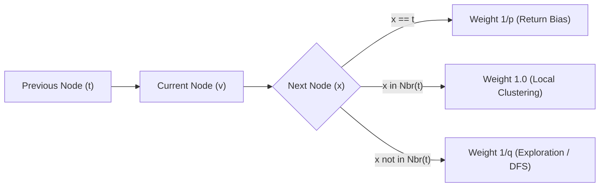

# genpark-node2vec-biased-random-walk-embedding-skill

Agent Skill implementing **Node2Vec 2nd-Order Biased Random Walks** exploring local neighborhoods (DFS vs BFS) via return parameter $p$ and in-out parameter $q$.

## Architectural Overview

